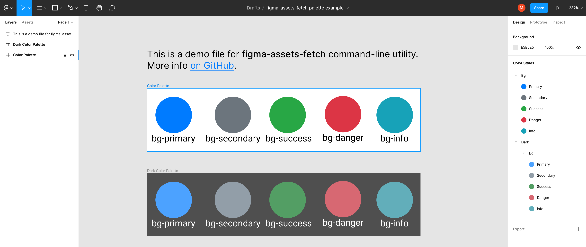

# figma-assets-fetch

A macOS command-line utility for template-based code generation from Figma assets. Unlike other similar utilities it follows the *conventions-over-configurations* principle, which requires less effort in development and usage.

## What can it do?

- It can perform template based code generation from Figma frame with colors;
- It can generate `*.xcassets` file with color set obtained from Figma frame.

## Getting Started

### Figma part
1. Prepare your color palette in a separate frame in your Figma file. It should contain a certain number of ellipses, each of which must be filled with the appropriate color. See the [example file](https://www.figma.com/file/1z5n1txr0nz7qMVzcS3Oif/figma-assets-fetch-palette-example?node-id=0%3A1).

1. Every color you use in your palette should have a style with some name. Alternatively you can set the name of the ellipse filled with that color (if the style is not set, the utility will parse color name from the ellipse name).

### Template part
The template file is just a [Stencil](https://github.com/stencilproject/Stencil) template. All colors obtained from Figma, are being passed to template as an array of objects. Refer to [NamedColor](https://github.com/movch/figma-assets-fetch/blob/main/Sources/FigmaAssetsFetch/Domain/Entities/NamedColor.swift) to gain understanding about such objects content.

Example template:

    import UIKit

    public enum Color {
    
        case {{ color.name.camelCased }}
    

        public var value: UIColor {
            switch self {
            
            case .{{ color.name.camelCased }}:
                return UIColor(
                    red: {{ color.value.r }},
                    green: {{ color.value.g }},
                    blue: {{ color.value.b }},
                    alpha: {{ color.value.a }}
                )
            
            }
        }
    }
    
Save it to file with `*.stencil` extension.

### Commands reference
To run the utility you need to pass several parameters, use `figma-assets-fetch help` for detail description of parameters, or refer to the examples below.

#### `colors-code-gen` command
This command is used for template-based code generation of colors obtained from Figma file.
        
    figma-assets-fetch \ 
        colors-code-gen \ 
        --figma-token $FIGMA_TOKEN \ #Figma API token \ 
        --colors-node-url "https://www.figma.com/file/1z5n1txr0nz7qMVzcS3Oif/figma-assets-fetch-palette-example?node-id=1%3A3" \ 
        --template-path "/Users/michael/Documents/ColorsEnum.stencil" \
        --output "/Users/michael/Documents/Colors.swift"

#### `colors-xc-assets` command
This command is used to generate `*.xcassets` file with colors from Figma.

    figma-assets-fetch \
        colors-xc-assets \ 
        --figma-token $FIGMA_TOKEN \ #Figma API token
        --colors-node-url "https://www.figma.com/file/1z5n1txr0nz7qMVzcS3Oif/figma-assets-fetch-palette-example?node-id=1%3A3" \ 
        --dark-colors-node-url "https://www.figma.com/file/1z5n1txr0nz7qMVzcS3Oif/figma-assets-fetch-palette-example?node-id=401%3A2" \ #Optional
        --output "/Users/michael/Documents/Colors.xcassets" 

*Note*: light and dark colors are being matched by name, dark color name should contain light color name. E.g. `Bg / Primary` and `Dark / Bg / Primary` will be matched.

## F.A.Q

### What is `figma-token`?
You can generate your access token on the Figma account settings page.

### What is `*-node-url`?
Node URL is a URL of frame in Figma that contains required content. To get it by click the right mouse button on frame and select *Copy link*.

## Building
The utility is written in Swift for macOS. Just clone the repository and build the project with the latest version of Xcode.
